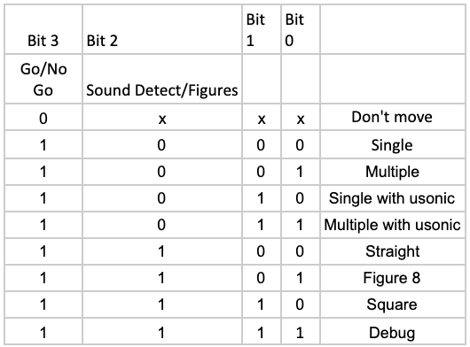

# Deliverable 5

For deliverable 5, you will be taking on your first checkpoint. In this deliverable we will be doing in class checks of the mode inputs(autonomus pi) as well as the Figure drawing(straight line, square, figure 8). Below you will find the resources you may need as well as the description of the deliverable. Refer back to the [README](../README.md) for more information.

## Complete Mode Inputs for Figure Drawing(D)
By now your team should have looked into auto start for your pi. If you haven't refer again to this [resource](./setup/launch-on-startup.md) You will use this along with the DIP switch provided in order to start your car, and start each mode of the drawing without having to connect to the pi using a monitor.

For this deliverable your team will be required to set up modes for your Audio Car these modes will correlate with 4 switches on the dip switches we provided you all. Here is a key of how those switches/modes will work:

The user will toggle a set of 4 switches using the table above. For this deliverable at minimum you should have the Straight, Figure 8, Square and Don't Move Mode Inputs Set up.

**NOTE:**  You should look at hysteresis techniques in software and/or hardware when using switches.

## Complete Figure Drawing(D)
This means not only getting the car moving in a straight line, square, and figure eight. This delieverable will also call for you all to create a transfer function that will allow both motors to run at the same rate. You will be tested on the accuracy of you previous transfer function along with the accuracy of the straight line, square, and figure eight.

**D:** As a part of this deliverable we ask you bring your car to class to demonstrate the work you have done so far. This is so we can get a feel for how  well the functionality has been implemented as well has grade you for this checkpoint. If completed successfully you will have made it to the minimum requirement for a 'C' in the class. **Remember this is not a guaranteed 'C' in the class but the minimum requirement to be eligible for it.**

## Finish Documentation for Figure Drawing/Mode Inputs

As you finish this checkpoint it is important to keep up woth your documentation.  In addition to the in-class demo, you'll also need to submit a video of the work you've completed for your the figure drawing checkpoint. It should be short and to the point, while showing each of the pieces of functionality that you've completed. This is primarily a fallback option for us to grade, in case hardware issues arise in class. Make sure you give commentary during the video so we know what you are doing. Follow the order found in the Project Description document on ELC.

# Summary

In summary, for this week you need to:

1. **D:** Have proof of 3 mode inputs, (Figure Skating, Single Detect, Differentiate Source). 

2. **D:** Physical Drawings, Your audio car should be able to go in a straight line, a square, and a figure eight. 

3. Update your User Manual and Technical Documentation with your findings.
