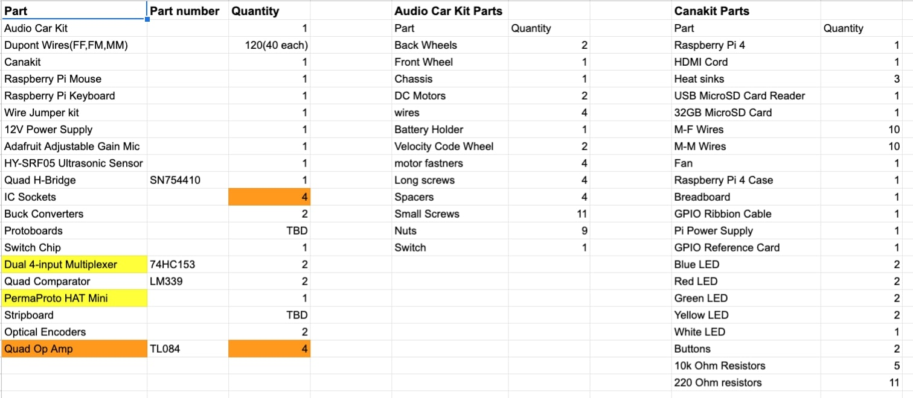
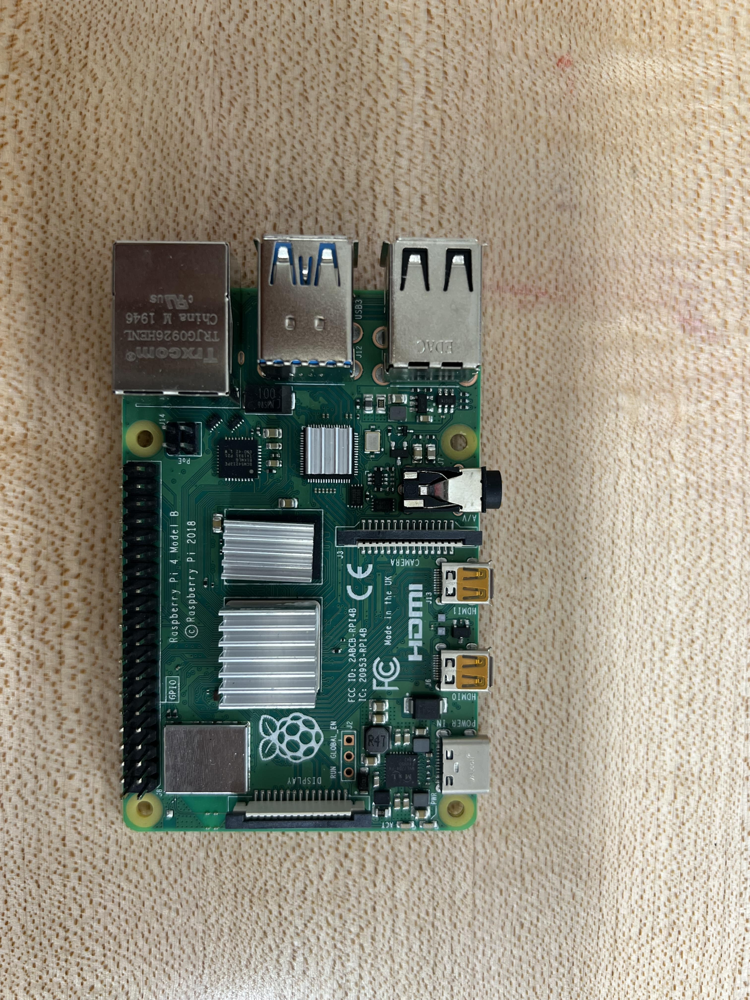
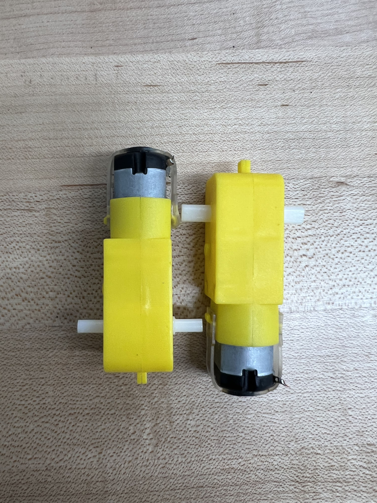
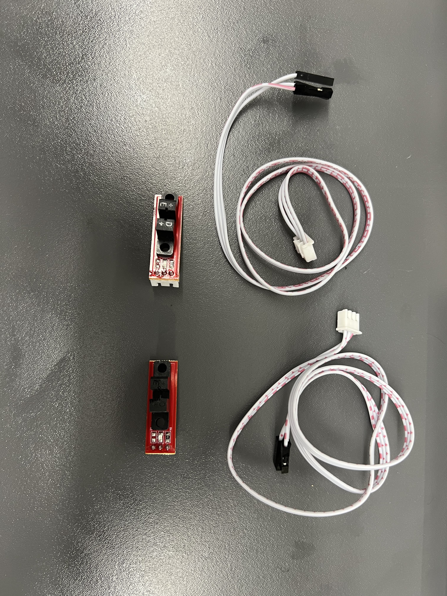
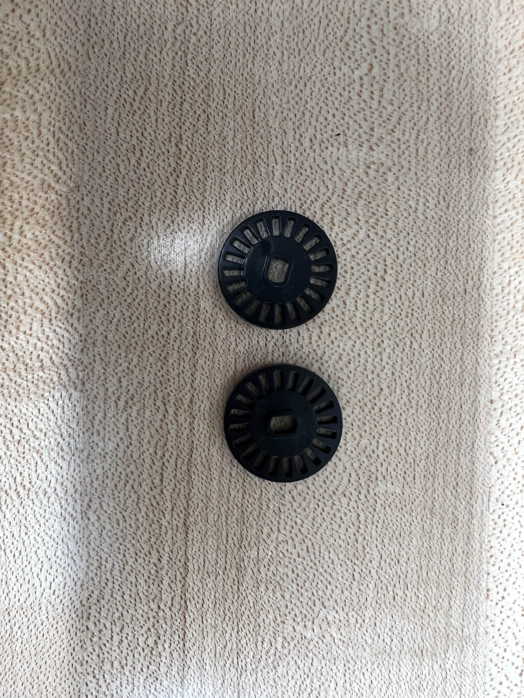
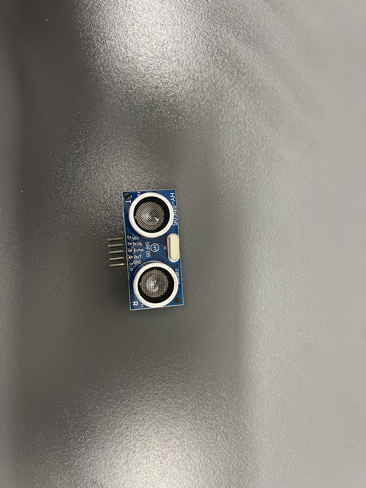

# Car Parts

In this document, students will find all parts included in their hardware kits along with some of the functions of the parts.

## Verify Existing Behavior

Inside you hardware kit you should have the following parts:

There are a few parts that you should check to see if they are in working condition those parts include:

1. Raspberry Pi - Check functionality by following the raspberry pi set up found in the deliverable instructions

2. Microphone - Check for sound detection

3. Motors - Check and make sure that both motors are working fully

4. Optical Encoders - Check for disk detection 

5. Ultrasonic Sensor - Check for distance detection

