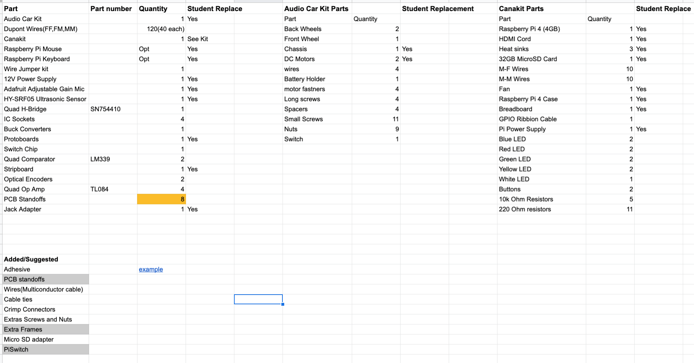

# Car Parts

In this document, students will find all parts included in their hardware kits along with some of the functions of the parts.

Links for these can be found on [this](https://github.com/Herring-UGAECSE-2920-S22/Class-Instructions/files/7901130/ECSE.2920.Spring.2022.Student.Part.List.xlsx) document

## Verify Existing Behavior

Inside you hardware kit you should have the following parts:

There are a few parts that you should check to see if they are in working condition a few of those parts include:

1. Raspberry Pi - Check functionality by following the raspberry pi set up found in the deliverable instructions

2. Microphone - Check for sound detection

3. Motors - Check and make sure that both motors are working fully

4. Optical Encoders - Check for disk detection 

5. Ultrasonic Sensor - Check for distance detection

