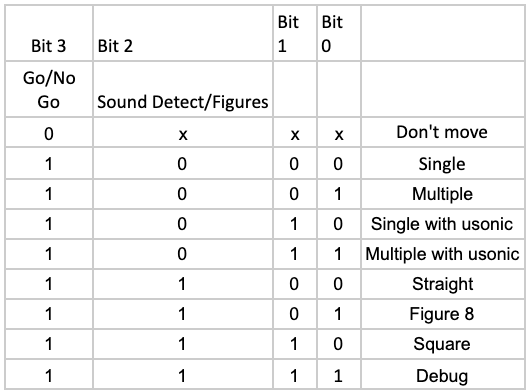

# Class-Instructions
Instructions for each checkpoint/module in this class, as well as helpful setup/configuration instructions. Below are the design parameters for your Audio Car, as well as some rules for the class

## Project Specifications
FIRST: MAKE SURE YOU REFERENCE THE ASSESSMENT DOCUMENT ON ELC WHICH DESCRIBES THE OUTLINE OF THE COURSEWORK AND HOW YOU CAN EXPECT TO BE ASSESSED.

Your objective this semester is to design a car which can autonomously identify, track, and move to a fixed set of audio frequencies using a Raspberry Pi 4 and the necessary accompanying hardware.

As covered later, in order to accomplish this you'll be using Python to program, two DC motors for your car. In addition to that, you will be using an H-Bridge chip to drive the motors.

Our objective is to keep your cost to a minimum. However, any additional components that  your team may need that are not supplied to you is your responsibility, and if your team “cooks” a key component (see list), your team must replace the component or receive an incomplete for the course. So pay attention to the resources, best practices, and hints mentioned on this GitHub as well as in class.

There are three key objectives in this class which will be represented by deliverables throughout the semester. Each of which will be graded based on a rubric which will be provided to you. These objectives include drawing figures, detecting a single sound frequency and moving to it, and differentiating between three different frequencies and moving to each in order. Parameters for these objectives will be listed below.

You should strive to make this work as closely to a finished product as possible, meaning doing sufficient bug testing, and making the product easy to setup/use. A part of this process is making sure your code runs on startup for the Raspberry Pi. A small writeup for how to do this can be [found here](Deliverables/setup/launch-on-startup.md).

### Input Mode for Commands(Deliverable 5a)
Your only input mode for the car is a set of 4 toggle switches using this table:
NOTE: You should look at hysteresis techniques in software and/or hardware when using switches.

 
Bit3: Go/No Go.  A good design will have hysteresis on this switch.
Bit=0: This allows you to change settings on the other bits and the environment while power is applied to the car.  In this mode, the car does nothing but is ready to “go”
Bit=1: This  tells the car to perform the function identified by the other switches and the environment.  When going from a “0” to a “1,” the car should wait 3 seconds before responding. 

All of the below checkpoints will be required to be controlled by toggle switches

### Drawing Figures (Deliverable 5b)
For the drawing figures checkpoint, your goal is to draw each of the required figures correctly. These are straight line, square, and figure 8 using the mode inputs. In your kit you will be provided a DIP switch which can be used to operate mode inputs by toggling 4 switches (See Project Description Document). In this checkpoint your car will be required to drive in a:

- **Straight Line:**  The car will move 3 feet in a straight line and stop.
- **Square:** The car will drive in a square that is 3 feet on each side 2 times and stop.
- **Figure 8:** The car will drive in a figure 8 pattern two times and stop.  The two straight center lines of the figure 8 will be 3 feet long. 
 
### Single Sound Detect (Deliverable 9)
For this checkpoint your car must  be able to detect a single sound frequency and move to it without hitting the source. This means you must be able to search for the sound using your skills from the last check point as well as identify the strength of the sound using your microphone and filter design. 
- The set up and objective of this checkpoint is as follows: A sound source will be placed 3-5 feet from the car and in any position with respect to the car(placed by grader. The car will identify and find the sound source .  The car will drive to the sound source and using the ultrasonic sensor, stop prior to hitting the source.  The front of the car must be within 4 inches of the source before stopping.  

### Differentiate Sources (Deliverable 12)
Finally this checkpoint will be your final product, this is a combination of all you have done in the other two checkpoints while adding two more sound sources. Your car must be able to differentiate three different frequencies which are playing simultaneously.  Your car must identify and move to each frequency source in the correct order and without hitting the source. 

- The set up and objective of this checkpoint is as follows: The three sound sources will be positioned within 3-5 feet of the starting position of the car (placed by grader).  The car will identify and find the sound sources in order (A, B, C).  The car front of the car must be within 4 inches of the sound source and stop.  After stopping, the car will find the next sound source in sequence.

When testing you can expect the following standards and restrictions for the sound in puts
### Sound inputs
The frequencies of interest are:
- 500 Hz sine wave
- 2KHz sine wave
- 8KHz sine wave
The volume energy of each sound is sufficient so that your car can find the sound within 5 feet from any position from your car’s starting point.
You may use a phone as a sound source.  There are many apps available for this.  You can also use a portable speaker/amplifier if you’d like.  It is up to your team to decide this.

### Documentation Expectations

Your project will have two required documents: 

For both documents, go to ELC and refer to the ECSE 2920 Spring 2022 Assessments for specific requirements and for the rubric(scoring) metrics for each of the User Manual and the Technical Description of the Design.

1. A User’s Manual
    
    - Write a complete step-by-step document instructing a novice user how to use your audio car. Think about your car as a product bought by the user. The manual will instruct the user on all of the functions of your car. 
    - From your own experience, pictures, drawings, diagrams, etc… make a user’s manual much more beneficial. 
    - Don’t forget to think about a section on errors or what might go wrong, faqs, clarification, etc. 
    - User Manuals also contain safety information for the user.

2. A full Technical Description of the Design

    - Write a complete technical design guide for your car. It should describe every facet of the design (hardware and software). It should allow a person skilled in the art to recreate your design. It should provide appropriate technical reasoning for design decisions including simulation, circuit schematics and design tradeoffs.
    - Multisim, photos of oscilloscope simulations, photos of circuits, Logic.ly simulation, Code examples for key parts of algorithms (the full code will be uploaded on GitHub), and paper worked out notes are all examples. Some of these can also be part of and come from the project management document (see below).
    - At a minimum, each progress deliverable and design deliverable should be ***WELL*** documented and occupy a chapter in the document.
    - Because every group will have different approaches to the solution, we can not give a complete requirement that every document must contain. In short, if there is something that makes your plotter work, you must document it.
    - What if your group did not design it? One example is the mechanical structure of the car itself. In this case, like in any technical document, you must reference the source. You should also describe the function but do not need to get into the design details (structural stress of the aluminum, for example).
    - What about your software? Each primary function probably has code written for it. Therefore, your document should include a chapter on the structure of your software.  Think about this as the table of contents and flow control for your software. Each of the car’s features/functions that includes software and hardware is most likely a progress or design deliverable and will have a chapter in the document. Use the deliverable chapter to more fully describe the software and hardware.  
    - If you used pre-written libraries, you must reference them and briefly describe the function. Any code that you wrote from scratch should be well documented (and commented in the code).
    - Neatest, precision, and completeness will be assessed. Professionalism in content and in the presentation will also be assessed.
    
### Submitting Work

- When submitting work for this class, it will go in the deliverable assignment folder for that week. This includes any work needed for **P** and **D** deliverables, your Weekly Project Management Report, etc. Any code for your group should remain on your group GitHub repository, and you should make sure to update this with your latest work before deliverables are due.

- When submitting pictures or videos as part of your deliverable, be sure to have your subject in focus and easily seen. Make your videos short and to the point, and make sure you don't have shaky hands while you're filming.

- When submitting writing of any kind, make sure it's clear, concise, and overall decent to read. When formatting is necessary, you can assume 1.15 line spacing, and 12 pt Times New Roman or Calibri font.

## Project Rules/Best Practices
- Below is a set of rules to follow while working on this project in addition to any established on the syllabus. These are generally best practices for keeping your project organized and on track.

### Breadboard Wiring

When wiring up components with a breadboard it is crucial that your wires stay organized and distinguishable. If you don’t follow these practices, you’re likely to screw up the wiring for your audio car often, which not only leads to frustration and wasted time, but could also be fatal for your more sensitive components such as the H-Bridge chip or the Raspberry Pi. If you follow these steps, you will be well on your way to avoiding the most common pitfalls:

1. ### Use Clean Wiring

- Keep your wiring clean. Avoid excessively long wires which make it impossible to trace if there is a problem and are more prone to pull out. You can either purchase wires that are pre-cut to different lengths or make them yourself. 

2. ### Use Color Coding

- Another tip is to organize your wires so that the color matches the circuit's electrical property. This will help you identify what types of wires are which when troubleshooting your breadboard circuits. The most common wire color coding is that all POWER wires should be RED, and all GROUND wires should be BLACK.

- As you get more advanced, you can have different colors representing different voltage levels and functions. For example you can add a separate color for digital signals with 5V logic, and another for 3.3V.

- For analog circuits, you may want to have a specific color for an amplifier input or output, and yet another color to identify an ADC input.

- Besides organization, this will really help you spot mis-wirings before you apply power and potentially damage your hardware. Keep a careful lookout for RED and BLACK wires connecting to the same terminal strip, as this could indicate a short.

### Maintaining your Group Github Repository

In order to encourage you to learn the useful skill of managing and using a Git/Github repository, we ask to keep your group repository up to date, follow the [Github Flow](https://guides.github.com/introduction/flow/) and to use Git/Github features like [issues](https://guides.github.com/features/issues/) to your advantage! More information on Git/Github and how to learn it will be provided in the deliverable instructions.

### Code Style/Conventions

- Your code should follow the commonly accepted code style conventions outlined in [PEP 8](https://www.python.org/dev/peps/pep-0008/) on the official Python website. In addition to the practices outlined in PEP 8, you should follow [Object-Oriented Programming](https://en.wikipedia.org/wiki/Object-oriented_programming) principles when necessary (we'll generally let you know if something needs to be a class) and avoid creating [monolithic](https://en.wikipedia.org/wiki/Monolithic_application) software; instead opt to break your software into smaller, more manageable and maintainable pieces.

- While mildly outlined in the PEP 8 document above, we'd like to reiterate that commenting your code is crucial to both the development and grading process. A good rule of thumb to follow is that a comment should *only* be added to answer a question that the code can't. In essence, if you follow the PEP 8 naming conventions and give your variables/objects meaningful names, it won't take very long to understand most code; in some ways, the code *becomes* the documentation. However, if you use a little optimization trick here, or implement a complicated operation/algorithm there, you should add a comment explaining your implementation or methodology.

### Power
- Don’t use the PI as a power bus. Power everything directly from the buck converter set to 5v.
- Adjust the buck converter to ~ 5v before hooking it up to the hardware. After it is loaded down by the pi, h-bridges, etc readjust its output voltage to 5v.
- Be careful not to short the power pins of the pi to other power pins or ground. That’ll kill em. 

### Analog Audio Path
- The output of the microphone is centered around 0v. 
- An opamp can’t output any voltage close to its negative rail. 
- Capacitors block DC voltage. 
- Don’t limit your headroom with a 0-5v supply voltage when 0-12v is available.

### ADC
- Make sure you sample the peak of the input signal.

### H-Bridge
- There are separate logic supply and motor supply pins. Both can be at 5v. 

### Car Chassis
- Don’t drive it off a table. It is very fragile. It will break easily. 

### Class Discussion

To facilitate class discussions, we will be using this repository’s **Issues** page to post comments or questions. This is a great place to ask general questions pertaining to the course and project. You are encouraged to join the discussion but just remember to abide by the “Collaboration Policy” detailed in the course syllabus. 

To post a question or comment, see the Issues link at the top of the repository or follow this [link](https://github.com/Herring-UGAECSE-2920-S22/Class-Instructions/issues). The submission process is self explanatory. 
